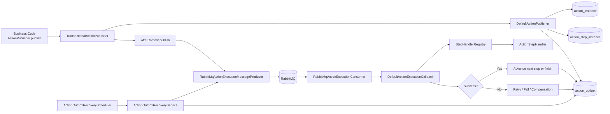

# action-guard

`action-guard` 是一个面向 Spring Boot 3 应用的、基于 Outbox 的异步 Action 编排与治理框架。

它解决的是这类问题：主交易已经成功提交，但交易后的异步副作用不能丢，还需要具备重试、补偿、告警和人工治理能力。

当前仓库状态：`early preview`。

## 适用场景

适合这类“主交易后异步副作用必须可靠”的业务：

- 订单取消后的售后动作
- 支付完成后的通知链路
- 优惠券、会员、权益回收
- 账户状态向下游系统传播
- 一切“不适合写回主事务里，但又不能静默丢失”的后置动作

## 它不是什么

`action-guard` 不是一个通用工作流引擎，也不是 BPM 产品。

第一版聚焦于：

- 显式发布一个 Action
- 在本地事务内可靠落库
- 按 YAML 定义的串行步骤异步执行
- 在失败时进入重试、补偿或人工治理

不以支持 DAG、并行分支、复杂 DSL 编排为目标。

## 核心能力

- 基于 Outbox 的可靠发布
- 基于 MQ 的异步步骤投递与执行
- 基于 YAML 的 Action 定义加载
- 严格串行步骤编排
- `stepType -> handler` 的扩展注册模型
- 步骤级重试、超时、补偿与幂等契约
- 消费去重与重复消费治理
- 告警、审计与人工治理入口

## 架构图



## 运行链路

1. 业务代码调用 `ActionPublisher.publish(ActionRequest)`。
2. 框架在同一本地事务内写入 `action_instance`、`action_step_instance` 和 `action_outbox`。
3. 事务提交后，执行消息被投递到 MQ。
4. MQ consumer 收到消息后，调用 `ActionExecutionCallback`。
5. Runtime 根据 Action 定义找到当前步骤，调用对应 `ActionStepHandler`。
6. 执行成功则推进到下一步；执行失败则进入重试、补偿、告警或人工治理。
7. 如果即时投递失败或节点中断，recovery 链路会继续扫描 outbox 并补发。

## 最小使用模型

业务代码发布一个 Action：

```java
actionPublisher.publish(new ActionRequest(
        "order-cancel-flow",
        "order:12345",
        Map.of(
                "orderId", 12345L,
                "userId", 9988L,
                "refundId", "rf_001"
        ),
        List.of()
));
```

Action 定义决定提交后要异步执行哪些步骤：

```yaml
name: order-cancel-flow
description: Cancel order follow-up actions
steps:
  - name: revoke-coupon
    stepType: HTTP_CALL
    target: coupon-service/revoke
  - name: notify-user
    stepType: NOTIFY_SMS_SEND
    target: aliyun-sms
```

每个 `stepType` 都由一个已注册的 `ActionStepHandler` 执行，可以来自框架模块，也可以来自业务模块。

## 模块概览

- `action-guard-api`
  公共请求模型、定义模型、SPI 契约
- `action-guard-core`
  发布 runtime、定义加载、状态推进、重试、补偿、恢复、可观测性
- `action-guard-spring-boot-starter`
  自动装配、配置绑定、runtime 组装
- `action-guard-adapter-rabbitmq`
  RabbitMQ 消息投递与消费适配
- `action-guard-store-mysql`
  JDBC 持久化实现
- `action-guard-adapter-notify`
  通知能力适配
- `action-guard-alert-webhook`
  Webhook 告警通道
- `action-guard-ops-api`
  治理后台 API
- `action-guard-demo`
  示例应用

## 从哪里开始看

首次接入建议按这个顺序阅读：

- [快速开始](./docs/quick-start.md)
- [Starter 配置](./docs/starter-config.md)
- [定义规范](./docs/definition-spec.md)
- [架构设计](./docs/architecture.md)
- [模块选择建议](./docs/module-selection.md)

按主题深入阅读：

- [模块架构](./docs/module-architecture.md)
- [可观测性说明](./docs/observability.md)
- [StepType 扩展指南](./docs/step-type-extension-guide.md)
- [数据模型](./docs/data-model.md)
- [治理操作](./docs/ops-governance.md)
- [常见问题](./docs/faq.md)

示例和模板：

- [action-guard-demo](./examples/action-guard-demo)
- [最小应用配置模板](./docs/templates/action-guard-minimal-application.yml)

开源协作相关：

- [CONTRIBUTING.md](./CONTRIBUTING.md)
- [SECURITY.md](./SECURITY.md)
- [LICENSE](./LICENSE)
