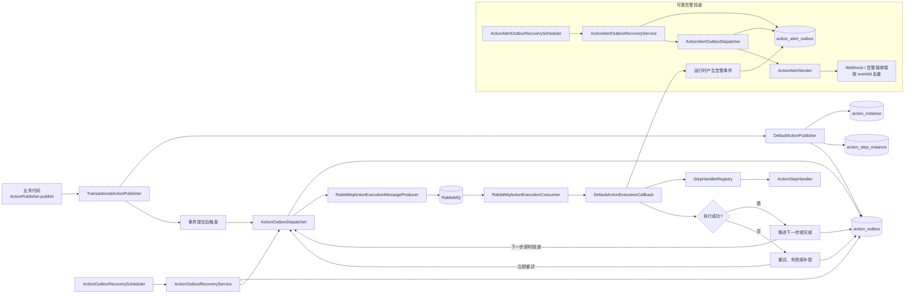

# action-guard

`action-guard` 是一个面向 Spring Boot 3 应用的、基于 Outbox 的异步 Action 编排与治理框架。

它解决的是这类问题：主交易已经成功提交，但交易后的异步副作用不能丢，还需要具备重试、补偿、告警和人工治理能力。

当前仓库状态：`early preview`。

项目仍在持续完善，当前重点是验证和打磨“可靠发布、串行执行、恢复与治理”的完整主链路。模块划分、内部接口和配置可能随需求调整，暂不承诺稳定生产版本的兼容性；涉及公共契约和存量数据的变化，需要说明影响及迁移方式，参见 [兼容性与版本策略](docs/maintenance/compatibility-and-versioning.md)。

## 适用场景

适合这类“主交易后异步副作用必须可靠”的业务：

- 订单取消后的售后动作
- 支付完成后的通知链路
- 优惠券、会员、权益回收
- 账户状态向下游系统传播
- 一切“不适合写回主事务里，但又不能静默丢失”的后置动作

## 它不是什么

`action-guard` 不是一个通用工作流引擎，也不是 BPM 产品。

第一版聚焦于：

- 显式发布一个 Action
- 在本地事务内可靠落库
- 按 YAML 定义的串行步骤异步执行
- 在失败时进入重试、补偿或人工治理

不以支持 DAG、并行分支、复杂 DSL 编排为目标。

## 核心能力

- 基于 Outbox 的可靠发布
- 基于同一数据源的步骤执行结果事务提交
- 基于 MQ 的异步步骤投递与执行
- 基于 YAML 的 Action 定义加载
- 严格串行步骤编排
- `stepType -> handler` 的扩展注册模型
- 步骤级重试、执行耗时超限判定、补偿扩展与幂等契约
- 消费去重与重复消费治理
- 独立告警 Outbox：告警与运行时状态原子落库，并支持恢复投递
- 具备认证授权、原因审计与持久化诊断能力的人工治理 API

## 当前接入与能力边界

- 接入应用必须显式配置 `action.guard.store.type=memory` 或 `mysql`；不再自动回退到内存。现有 H2 demo 使用 `mysql` 对应的 JDBC/MyBatis 实现，具体数据库由数据源配置决定，参见 [存储实现选择](docs/guides/starter-config.md#存储实现选择)。
- 推荐主路径为 `starter + rabbitmq + store-mysql`，再接入业务 `ActionStepHandler` 或能力适配模块。演示默认连接当前服务器的 MySQL 和 RabbitMQ，密码加载方式见 [demo 说明](examples/action-guard-demo/README.md)；H2 通过 `h2` profile 保留用于隔离验证。
- 默认 RabbitMQ 执行链路需显式配置 `action.guard.execution.transport=rabbitmq`。缺省不装配框架默认生产者和消费者，但不关闭其他业务使用的 Spring Boot `RabbitTemplate`
  ，仍兼容自定义消息生产者。示例拓扑按同一选择条件启用，用户自定义拓扑需自行添加启用条件。没有生产者时 Outbox
  不发送、不自动本地执行；取值、启动校验及迁移说明见 [执行传输选择](docs/guides/starter-config.md#执行传输选择)。
- Kafka、Redis 模块目前属于占位或待完善能力，不作为默认接入组合；具体选择参见 [模块选择建议](docs/guides/quick-start.md#模块选择)。
- 步骤超时目前在 Handler 返回后判定，不会主动中断阻塞调用；下游客户端仍需配置超时。
- MQ 发送与数据库状态更新不是原子操作，恢复可能重复投递。消费去重不能替代业务 Handler 和下游系统的幂等处理。
- 告警通过独立的 `action_alert_outbox` 在业务事务内入队，并使用 `NEW → CLAIMED → DONE / DEAD` 状态机恢复投递；未配置 `ActionAlertSender` 时记录保留为 `NEW`，可在后续接入 sender 后继续投递。`DONE` 仅表示
  sender 调用成功，不代表告警已被阅读；sender 成功但完成状态落库失败时可能重投，接收端必须按稳定的 `eventId` 去重。配置和诊断语义见 [治理与可观测性](docs/guides/ops-governance.md#告警与指标)
  与 [告警 Outbox 配置](docs/guides/starter-config.md#告警-outbox-配置项)。
- 治理 HTTP API 默认拒绝匿名访问：接入方需实现 `ActionOpsPrincipalResolver`，读操作要求 `READ` 权限，人工写操作需具备对应权限并提交非空白 `reason`；框架不再信任任意请求 Header
  声明操作人。详见 [治理与可观测性](docs/guides/ops-governance.md#当前状态)。
- 升级存量 MySQL 库前必须执行 `action-guard-store-mysql/src/main/resources/db/migration/V0.1.1__add_action_alert_outbox.sql`；新集成应实现 `ActionAlertSender`，过渡接口 `ActionAlertPublisher` 已标记为
  deprecated。迁移边界见 [兼容性与版本策略](docs/maintenance/compatibility-and-versioning.md#可靠告警-outbox-迁移)。
- YAML 配置以当前加载器实际支持的字段为准；规划中的能力不代表当前已可用。

## 架构图



## 运行链路

1. 业务代码调用 `ActionPublisher.publish(ActionRequest)`。
2. 框架在同一本地事务内写入 `action_instance`、`action_step_instance` 和 `action_outbox`。
3. 事务提交后，`ActionOutboxDispatcher` 抢占 Outbox，再通过消息生产者投递到 MQ。
4. MQ consumer 收到消息后，调用 `ActionExecutionCallback`。
5. Runtime 根据 Action 定义找到当前步骤，调用对应 `ActionStepHandler`。
6. Handler 返回后，在短事务内保存步骤结果、Action 状态、迁移日志及所需的后续 Outbox；提交后再投递下一步或重试消息。终态失败交由补偿或人工治理处理。
7. 如果即时投递失败或节点中断，recovery 链路会继续扫描 outbox 并补发。

首次发布、步骤推进和恢复扫描共用单条 Outbox 投递逻辑：抢占为 `CLAIMED`，发送成功后保存 `DONE`，发送失败回退 `NEW`。`DONE` 只表示投递完成，不表示消息已消费或整个 Action 已成功。

执行结果的事务一致性要求相关数据库仓储共用数据源和事务管理器，参见 [事务接入条件](docs/guides/starter-config.md#执行结果事务接入)。数据库回滚不会撤销下游副作用，Handler 仍需支持幂等重试。

### 告警与治理链路

运行时产生的告警会与对应业务状态变更在同一事务内写入 `action_alert_outbox`，再由独立恢复调度执行抢占、单次外发和状态推进。外发失败会退避回到 `NEW`，达到最大投递次数后进入 `DEAD`；外发成功但 `DONE`
落库失败时允许后续重投，因此告警投递是 at-least-once，接收端必须按 `eventId` 去重。未配置 `ActionAlertSender` 不会阻止告警入队，记录可通过治理 API 诊断，并在后续接入 sender 后恢复投递。

治理 API 提供 Action、执行 Outbox、告警 Outbox 和审计查询，以及受权限控制的重试、跳过、取消与补偿操作；所有人工写操作必须提供 `reason`
，并记录到持久化审计。详细语义见 [治理与可观测性](docs/guides/ops-governance.md)。

## 最小使用模型

业务代码发布一个 Action：

```java
actionPublisher.publish(new ActionRequest(
        "order-cancel-flow",
        "order:12345",
        Map.of(
                "orderId", 12345L,
                "userId", 9988L,
                "refundId", "rf_001"
        ),
        List.of()
));
```

Action 定义决定提交后要异步执行哪些步骤：

```yaml
name: order-cancel-flow
description: 订单取消后的后续动作
steps:
  - name: revoke-coupon
    stepType: HTTP_CALL
    target: coupon-service/revoke
  - name: notify-user
    stepType: NOTIFY_SMS_SEND
    target: aliyun-sms
```

每个 `stepType` 都由一个已注册的 `ActionStepHandler` 执行，可以来自框架模块，也可以来自业务模块。

上例用于说明定义结构：`HTTP_CALL` 需要注册对应业务 Handler，短信步骤还需接入实际 Sender；仅声明 YAML 不会自动获得下游调用能力。可运行示例见 [action-guard-demo](examples/action-guard-demo)。

## 模块概览

- `action-guard-api`
  公共请求模型、定义模型，以及 Action、告警和指标 SPI 契约
- `action-guard-core`
  发布 runtime、定义加载、状态推进、重试、补偿、执行与告警 Outbox 恢复、可观测性
- `action-guard-spring-boot-starter`
  自动装配、配置绑定、runtime 组装，以及执行与告警 Outbox 恢复调度
- `action-guard-adapter-rabbitmq`
  RabbitMQ 消息投递与消费适配
- `action-guard-store-mysql`
  MyBatis / JDBC 持久化实现，以及执行与告警 Outbox 的 Schema 迁移
- `action-guard-adapter-notify`
  通知能力适配
- `action-guard-adapter-im`
  IM 群组与消息能力适配
- `action-guard-alert-webhook`
  基于 `ActionAlertSender` 的 Webhook 告警通道
- `action-guard-ops-api`
  治理查询、人工命令、鉴权、审计和告警 Outbox 诊断 API
- `action-guard-ops-web`
  独立治理应用入口，当前主要能力由 ops-api 提供
- `action-guard-demo`
  示例应用

## 从哪里开始看

完整入口见 [文档导航](docs/README.md)，按接入使用、架构设计和版本维护分类。

- 首次接入：[快速开始](docs/guides/quick-start.md) → [Starter 配置](docs/guides/starter-config.md)
- 理解执行机制：[运行时架构](docs/reference/architecture.md)
- 接入告警与人工治理：[治理与可观测性](docs/guides/ops-governance.md) → [告警 Outbox 配置](docs/guides/starter-config.md#告警-outbox-配置项)
- 升级已有 MySQL 数据库：[兼容性与版本策略](docs/maintenance/compatibility-and-versioning.md#可靠告警-outbox-迁移)
- 运行示例：[action-guard-demo](examples/action-guard-demo/README.md)

## 参与完善

优先围绕当前需求完善主链路、收敛重复实现、补齐故障场景测试和接入文档。允许在任务范围内优化内部设计；变更公共接口、配置或持久化格式时，核对实际使用与兼容性影响，并同步调用方、测试和文档。

验证从受影响模块的定向测试开始，按风险扩大范围。检查目标测试是否实际执行，并明确报告跳过和未验证项；内存或 H2 测试通过不等于真实 MySQL、RabbitMQ 联调通过。

协作入口：

- [项目协作约定 AGENTS.md](AGENTS.md)：代理在本仓库工作的边界、实现约束和验证要求
- [CONTRIBUTING.md](CONTRIBUTING.md)
- [SECURITY.md](SECURITY.md)
- [LICENSE](LICENSE)
