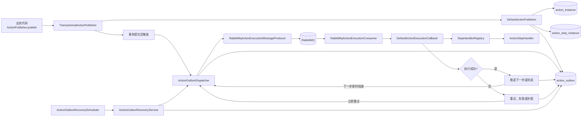

# action-guard

`action-guard` 是一个面向 Spring Boot 3 应用的、基于 Outbox 的异步 Action 编排与治理框架。

它解决的是这类问题：主交易已经成功提交，但交易后的异步副作用不能丢，还需要具备重试、补偿、告警和人工治理能力。

当前仓库状态：`early preview`。

项目仍在持续完善，当前重点是验证和打磨“可靠发布、串行执行、恢复与治理”的完整主链路。模块划分、内部接口和配置可能随需求调整，暂不承诺稳定生产版本的兼容性；涉及公共契约和存量数据的变化，需要说明影响及迁移方式，参见 [兼容性与版本策略](./docs/compatibility-and-versioning.md)。

## 适用场景

适合这类“主交易后异步副作用必须可靠”的业务：

- 订单取消后的售后动作
- 支付完成后的通知链路
- 优惠券、会员、权益回收
- 账户状态向下游系统传播
- 一切“不适合写回主事务里，但又不能静默丢失”的后置动作

## 它不是什么

`action-guard` 不是一个通用工作流引擎，也不是 BPM 产品。

第一版聚焦于：

- 显式发布一个 Action
- 在本地事务内可靠落库
- 按 YAML 定义的串行步骤异步执行
- 在失败时进入重试、补偿或人工治理

不以支持 DAG、并行分支、复杂 DSL 编排为目标。

## 核心能力

- 基于 Outbox 的可靠发布
- 基于 MQ 的异步步骤投递与执行
- 基于 YAML 的 Action 定义加载
- 严格串行步骤编排
- `stepType -> handler` 的扩展注册模型
- 步骤级重试、执行耗时超限判定、补偿扩展与幂等契约
- 消费去重与重复消费治理
- 告警、审计与人工治理入口

## 当前接入与能力边界

- 推荐主路径为 `starter + rabbitmq + store-mysql`，再接入业务 `ActionStepHandler` 或能力适配模块。本地演示使用 H2 文件库，MySQL 接入需单独配置与验证。
- Kafka、Redis 模块目前属于占位或待完善能力，不作为默认接入组合；具体选择参见 [模块选择建议](./docs/module-selection.md)。
- 步骤超时目前在 Handler 返回后判定，不会主动中断阻塞调用；下游客户端仍需配置超时。
- MQ 发送与数据库状态更新不是原子操作，恢复可能重复投递。消费去重不能替代业务 Handler 和下游系统的幂等处理。
- YAML 配置以当前加载器实际支持的字段为准；规划中的能力不代表当前已可用。

## 架构图



## 运行链路

1. 业务代码调用 `ActionPublisher.publish(ActionRequest)`。
2. 框架在同一本地事务内写入 `action_instance`、`action_step_instance` 和 `action_outbox`。
3. 事务提交后，`ActionOutboxDispatcher` 抢占 Outbox，再通过消息生产者投递到 MQ。
4. MQ consumer 收到消息后，调用 `ActionExecutionCallback`。
5. Runtime 根据 Action 定义找到当前步骤，调用对应 `ActionStepHandler`。
6. 执行成功则推进到下一步；执行失败则进入重试、补偿、告警或人工治理。
7. 如果即时投递失败或节点中断，recovery 链路会继续扫描 outbox 并补发。

首次发布、步骤推进和恢复扫描共用单条 Outbox 投递逻辑：抢占为 `CLAIMED`，发送成功后保存 `DONE`，发送失败回退 `NEW`。`DONE` 只表示投递完成，不表示消息已消费或整个 Action 已成功。

## 最小使用模型

业务代码发布一个 Action：

```java
actionPublisher.publish(new ActionRequest(
        "order-cancel-flow",
        "order:12345",
        Map.of(
                "orderId", 12345L,
                "userId", 9988L,
                "refundId", "rf_001"
        ),
        List.of()
));
```

Action 定义决定提交后要异步执行哪些步骤：

```yaml
name: order-cancel-flow
description: 订单取消后的后续动作
steps:
  - name: revoke-coupon
    stepType: HTTP_CALL
    target: coupon-service/revoke
  - name: notify-user
    stepType: NOTIFY_SMS_SEND
    target: aliyun-sms
```

每个 `stepType` 都由一个已注册的 `ActionStepHandler` 执行，可以来自框架模块，也可以来自业务模块。

上例用于说明定义结构：`HTTP_CALL` 需要注册对应业务 Handler，短信步骤还需接入实际 Sender；仅声明 YAML 不会自动获得下游调用能力。可运行示例见 [action-guard-demo](./examples/action-guard-demo)。

## 模块概览

- `action-guard-api`
  公共请求模型、定义模型、SPI 契约
- `action-guard-core`
  发布 runtime、定义加载、状态推进、重试、补偿、恢复、可观测性
- `action-guard-spring-boot-starter`
  自动装配、配置绑定、runtime 组装
- `action-guard-adapter-rabbitmq`
  RabbitMQ 消息投递与消费适配
- `action-guard-store-mysql`
  MyBatis / JDBC 持久化实现
- `action-guard-adapter-notify`
  通知能力适配
- `action-guard-adapter-im`
  IM 群组与消息能力适配
- `action-guard-alert-webhook`
  Webhook 告警通道
- `action-guard-ops-api`
  治理后台 API
- `action-guard-ops-web`
  独立治理应用入口，当前主要能力由 ops-api 提供
- `action-guard-demo`
  示例应用

## 从哪里开始看

首次接入建议按这个顺序阅读：

- [快速开始](./docs/quick-start.md)
- [Starter 配置](./docs/starter-config.md)
- [定义规范](./docs/definition-spec.md)
- [架构设计](./docs/architecture.md)
- [模块选择建议](./docs/module-selection.md)

按主题深入阅读：

- [模块架构](./docs/module-architecture.md)
- [可观测性说明](./docs/observability.md)
- [StepType 扩展指南](./docs/step-type-extension-guide.md)
- [数据模型](./docs/data-model.md)
- [治理操作](./docs/ops-governance.md)
- [常见问题](./docs/faq.md)

示例和模板：

- [action-guard-demo](./examples/action-guard-demo)
- [最小应用配置模板](./docs/templates/action-guard-minimal-application.yml)

## 参与完善

优先围绕当前需求完善主链路、收敛重复实现、补齐故障场景测试和接入文档。允许在任务范围内优化内部设计；变更公共接口、配置或持久化格式时，核对实际使用与兼容性影响，并同步调用方、测试和文档。

验证从受影响模块的定向测试开始，按风险扩大范围。检查目标测试是否实际执行，并明确报告跳过和未验证项；内存或 H2 测试通过不等于真实 MySQL、RabbitMQ 联调通过。

协作入口：

- [项目协作约定 AGENTS.md](./AGENTS.md)：代理在本仓库工作的边界、实现约束和验证要求
- [CONTRIBUTING.md](./CONTRIBUTING.md)
- [SECURITY.md](./SECURITY.md)
- [LICENSE](./LICENSE)
