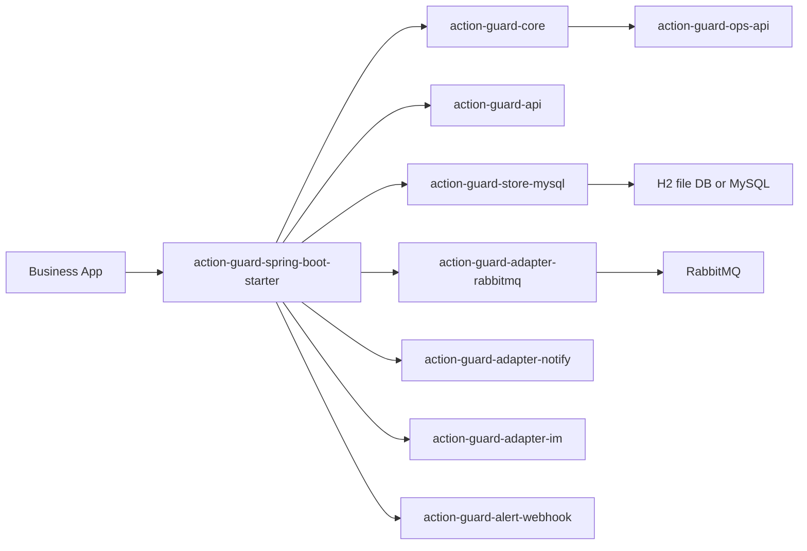

# 模块架构

## 目标

这份文档从“模块怎么拼起来”而不是“运行时原理”出发，帮助接入方快速理解：

- 最小可运行闭环需要哪些模块
- 每个模块负责什么边界
- 演示环境与生产环境分别怎么组合

如果你还没看过运行时原理，建议先读：

- [架构设计](/Users/lejinbo/LLM/action-guard/docs/architecture.md)
- [快速开始](/Users/lejinbo/LLM/action-guard/docs/quick-start.md)

## 模块视图

## 最小演示组合

本地最小闭环建议：

- `action-guard-spring-boot-starter`
- `action-guard-store-mysql`
- `action-guard-adapter-rabbitmq`
- 一个能力模块，例如 `action-guard-adapter-notify`

基础设施建议：

- H2 文件库
- RabbitMQ

这是仓库当前默认演示路径。

## 面向生产的组合方式

如果你准备接近真实生产接入，建议：

- 保留 `starter + store-mysql + rabbitmq`
- 按需接入 `notify / im / alert-webhook`
- datasource 从 H2 切换到 MySQL
- 再接入治理 API

这样可以在不改业务编排模型的前提下，从演示环境平滑切到真实数据库。

## 模块职责

### `action-guard-api`

负责公共模型与 SPI：

- `ActionRequest`
- `ActionExecutionMessage`
- 定义模型
- handler SPI / sender SPI

### `action-guard-core`

负责编排内核：

- Action 发布主路径
- step 串行推进
- retry / compensation / observability
- recovery 扫描与 fencing 语义

### `action-guard-spring-boot-starter`

负责 Spring Boot 自动装配：

- 收集 definitions
- 收集 handlers / senders
- 组装 registry 和 runtime
- 暴露统一配置入口

### `action-guard-store-mysql`

负责 JDBC 持久化实现：

- `action_instance`
- `action_step_instance`
- `action_outbox`
- `action_consume_log`
- `action_compensation_log`

模块名称目前仍叫 `store-mysql`，但默认演示配置已经切到 H2 file 模式；线上可以直接切换到 MySQL。

### `action-guard-adapter-rabbitmq`

负责 MQ 适配：

- outbox 消息发布
- 消息消费
- 重复消费保护对接
- dead-letter / consume-failure 事件接入

### `action-guard-adapter-notify`

负责通知能力抽象：

- `NOTIFY_IN_APP_SEND`
- `NOTIFY_SMS_SEND`
- `NOTIFY_EMAIL_SEND`

### `action-guard-adapter-im`

负责 IM 协作能力抽象：

- `IM_GROUP_CREATE`
- `IM_GROUP_INVITE`
- `IM_GROUP_MESSAGE_SEND`

### `action-guard-alert-webhook`

负责把标准化告警事件投递到外部 webhook。

### `action-guard-ops-api`

负责治理查询与人工操作：

- Action 查询
- 详情查询
- retry / skip / cancel / compensate
- audit log query

## 推荐阅读顺序

如果你是第一次接入，建议顺序：

1. [快速开始](/Users/lejinbo/LLM/action-guard/docs/quick-start.md)
2. [Starter 配置说明](/Users/lejinbo/LLM/action-guard/docs/starter-config.md)
3. [模块选择建议](/Users/lejinbo/LLM/action-guard/docs/module-selection.md)
4. [模块架构](/Users/lejinbo/LLM/action-guard/docs/module-architecture.md)
5. [定义规范](/Users/lejinbo/LLM/action-guard/docs/definition-spec.md)

如果你要扩展能力模块，接着看：

1. [架构设计](/Users/lejinbo/LLM/action-guard/docs/architecture.md)
2. [StepType 扩展指南](/Users/lejinbo/LLM/action-guard/docs/step-type-extension-guide.md)
3. [治理操作](/Users/lejinbo/LLM/action-guard/docs/ops-governance.md)
